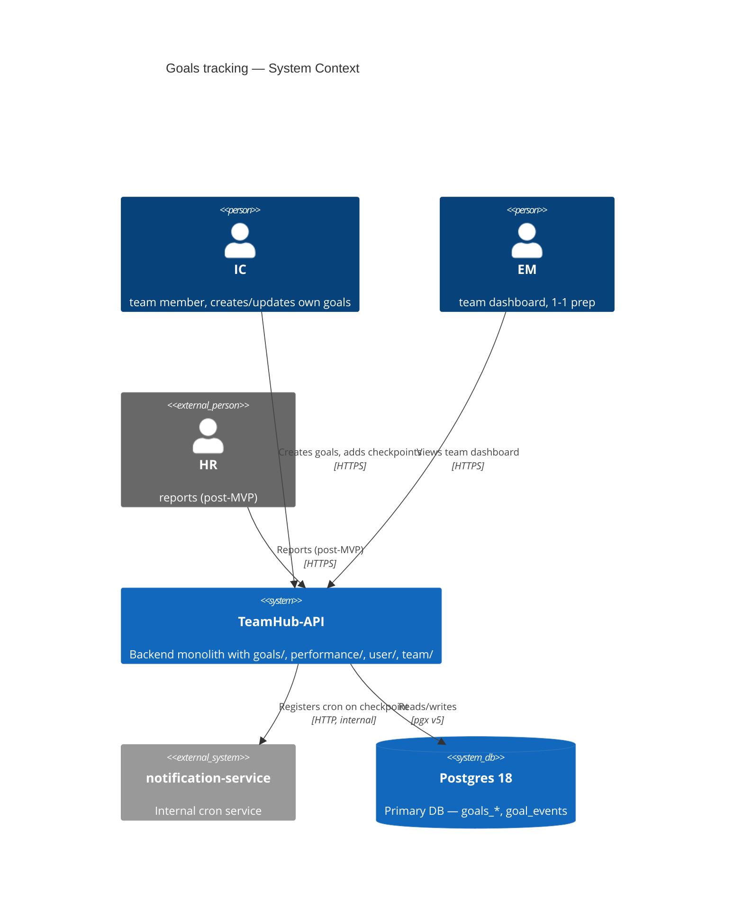
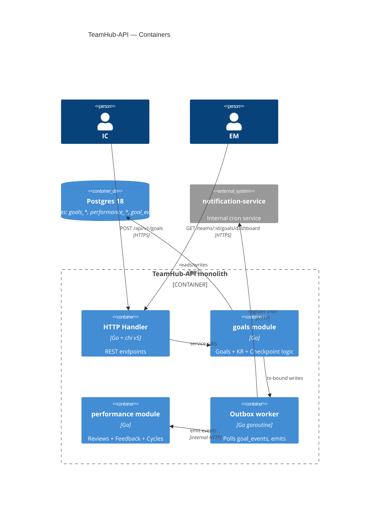
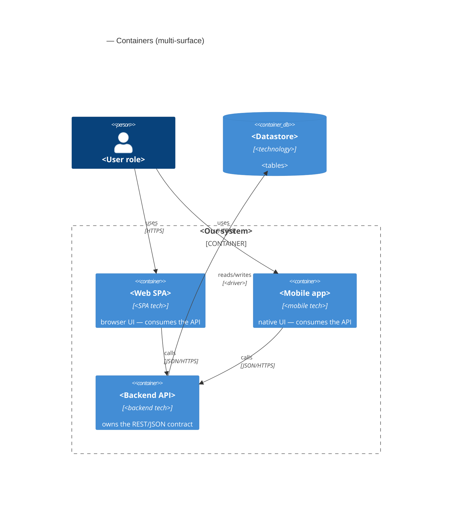

# C4 Mermaid syntax — quick reference for sad.md §3 and §5

## TL;DR — як читати C4-діаграму (короткий вступ українською)

C4 — це 4 рівні архітектурних діаграм як zoom на Google Maps:

- **L1 Context** — система як чорний ящик + користувачі + зовнішні системи. **Це §3 SAD.**
- **L2 Container** — внутрішня декомпозиція: модулі, сервіси, БД, черги. **Це §5 SAD.**
- L3 Component, L4 Code — поза межами цього skill.

**Як читати елементи на діаграмі:**
- `Person(...)` — внутрішній актор (наш користувач). `Person_Ext(...)` — зовнішній (наприклад, HR-департамент).
- `System(...)` — наша система. `System_Ext(...)` — зовнішня (Sentry, відео-провайдер).
- `Container(...)` — компонент всередині нашої системи (фронт, бек, worker).
- `ContainerDb(...)` — наша БД. `Container_Boundary(...)` — рамка навколо групи контейнерів (тобто «це деплоїться разом»).
- `Rel(від, до, "що робить", "як")` — стрілка з лейблом і протоколом (HTTPS / gRPC / SQL).

**Правило тлумачення:** *кордон довіри* (англ. *trust boundary*) — лінія, за якою ти більше не довіряєш даним без перевірки. На L1 — це межа між «нашими» акторами і зовнішніми системами; на L2 — межа `Container_Boundary` (наш моноліт vs зовнішні бази).

---

The `architecture-design` skill emits C4 Level 1 (Context) in §3 and Level 2 (Container) in §5 as Mermaid blocks inline in `sad.md`. L3 Component and L4 Code are deliberately out of scope — request a separate diagramming pass if you need them.

This file is a copy-paste-ready cheatsheet for the syntax. Mermaid renders natively in GitHub (since 2022) and Obsidian (via `mermaid-tools` plugin or core renderer).

## L1 — System Context (`C4Context`)

Use in §3. Shows the system as one black box plus people and external systems. 5-10 elements max.



**Element types:**
- `Person(id, "name", "description")` — internal actor.
- `Person_Ext(id, "name", "description")` — external actor.
- `System(id, "name", "description")` — internal system.
- `System_Ext(id, "name", "description")` — external system.
- `SystemDb(id, "name", "description")` — external database (rare at L1).
- `Rel(from, to, "label", "protocol")` — connection. Protocol is optional but recommended.

**Rules of thumb:**
- Show *your* system as one box. Decomposition lives in L2.
- External systems = different owner / different process / different lifecycle. Internal modules in the same monolith do **not** appear in L1.
- 5-10 elements total. If you have more, you're showing too much.

## L2 — Container (`C4Container`)

Use in §5. Shows the inside of your system: web apps, services, databases, queues. For a monolith, treat each *module* as a logical container.



**Element types:**
- `Container_Boundary(id, "label") { ... }` — groups containers inside one deployable unit.
- `Container(id, "name", "technology", "description")` — internal container (app, service, worker).
- `ContainerDb(id, "name", "technology", "description")` — internal datastore.
- `ContainerQueue(id, "name", "technology", "description")` — internal message queue.
- External `System_Ext` and `Person` can be reused from L1.

**Rules of thumb:**
- For a monolith: each module = one `Container`. Boundary brackets the whole process.
- Datastores live *outside* the boundary if they're separate processes (which is almost always).
- Show the worker goroutine / cron job / scheduled task as a separate container — its lifecycle matters even though it runs in-process.

**Multi-surface features — one `Container` per declared `target_surface`.** When §4 declares more than one surface (frontmatter `target_surfaces` → [`../../_shared/surfaces.md`](../../_shared/surfaces.md)), §5 draws one container for each. A `[backend-service, web-frontend, mobile-app]` feature shows the SPA **and** the mobile app **and** the backend API — both UI surfaces *consume* the API's contract, neither authors one:



## Common mistakes

- **Mixing levels.** Don't put a Component (a Go struct) inside a Container diagram. Either zoom out (it's part of the Container) or move to L3.
- **Typos in `Container_Boundary`.** Common: `Container_Bondary`, `ContainerBoundary` (no underscore). Mermaid silently renders an empty block.
- **`Rel` between elements not yet declared.** Declare all `Person`/`Container`/`System*` first, then `Rel` lines.
- **L1 with internal modules.** L1 = business scope. If your goals module shows up in L1, you're at L2 already.
- **No label or protocol on `Rel`.** "Connected" doesn't tell the reader anything. Always: what it does + how (HTTPS / gRPC / SQL / message).

## Validating Mermaid before commit

Validate every block per [`../../_shared/mermaid-check.md`](../../_shared/mermaid-check.md) — render-parse with `mmdc` if available, else the structural lint there. A block that doesn't parse must never be committed (it renders as a red error box).

```bash
# Optional pre-commit check — runs the CLI parser over the file (extracts every ```mermaid block).
mmdc -i docs/features/<slug>/sad.md -o /tmp/_mmd_check.md 2>&1   # exit != 0 → a block failed; stderr names it
```

In practice: open `sad.md` in Obsidian (with `mermaid-tools` plugin) or push to GitHub and inspect the rendered file. Both fail loudly on syntax errors.

## When the diagram doesn't fit

If you can't fit the L2 Container view in 10-15 elements:

- Split the feature into two SADs (one per bounded context).
- Or: drop tactical containers (e.g. the worker goroutine) into a note below the diagram instead of cluttering it.

If your L1 Context view has 15+ external systems, you're probably documenting the *organization* rather than the *feature*. Pull back to "the systems this feature directly talks to."
