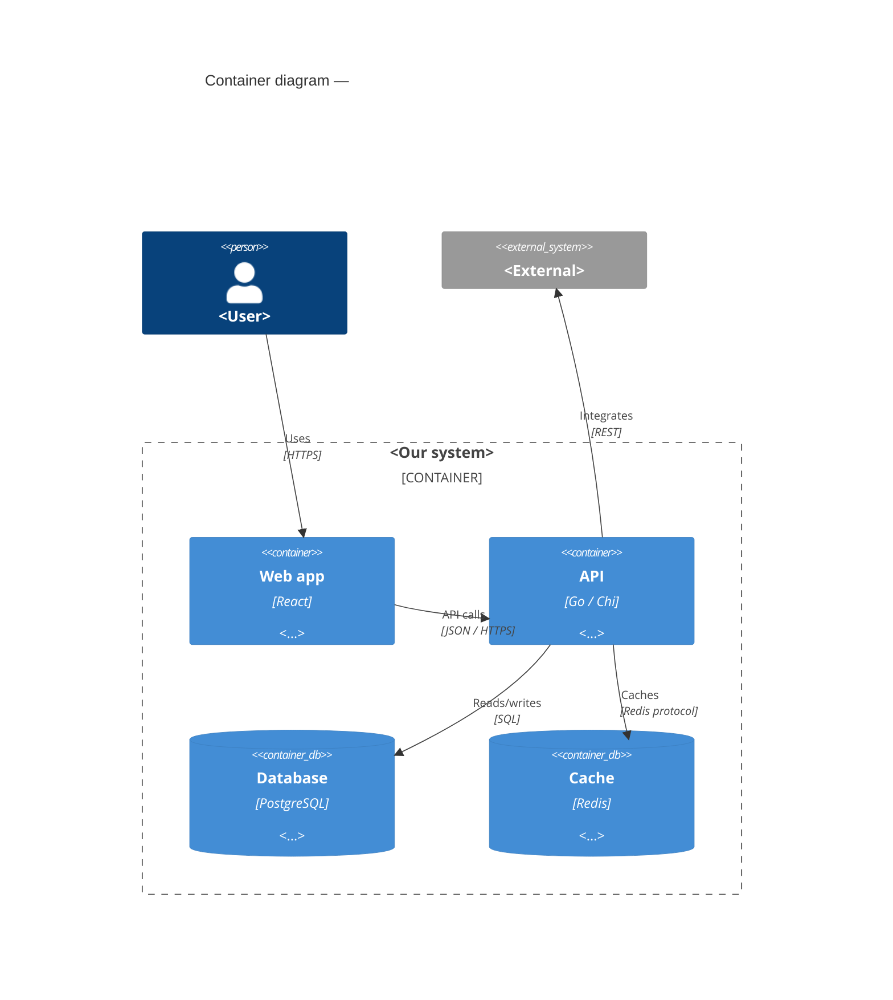

# C4 — Container

<!-- Stages 04-05 → see claude/plugins/vam-sdlc/skills/architecture-design/SKILL.md -->
<!-- Standalone L2 C4Container snippet — embedded inline in SAD §5. One Container per declared -->
<!-- target_surface (frontmatter). Syntax → references/c4-mermaid-syntax.md -->

