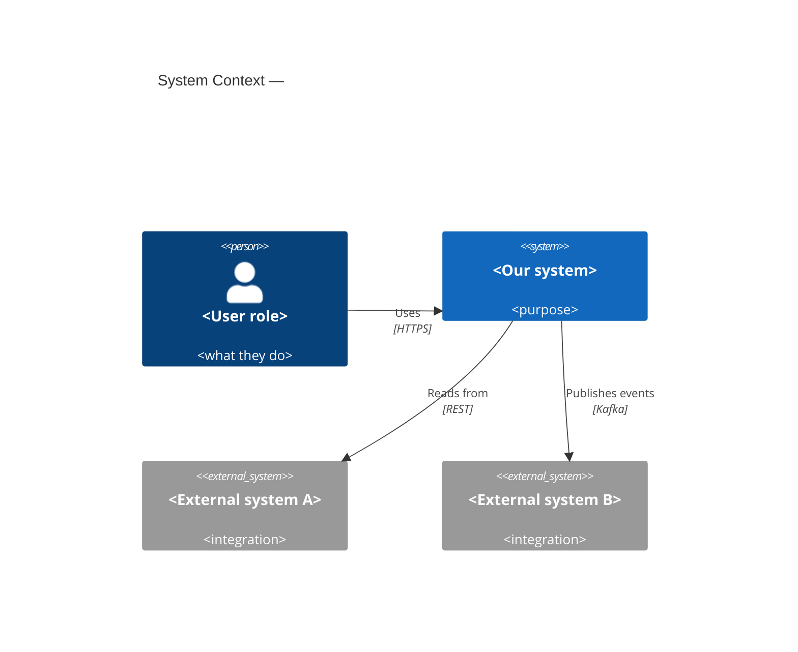

# C4 — Context

<!-- Stages 04-05 → see claude/plugins/vam-sdlc/skills/architecture-design/SKILL.md -->
<!-- Standalone L1 C4Context snippet — embedded inline in SAD §3. Syntax → references/c4-mermaid-syntax.md -->

