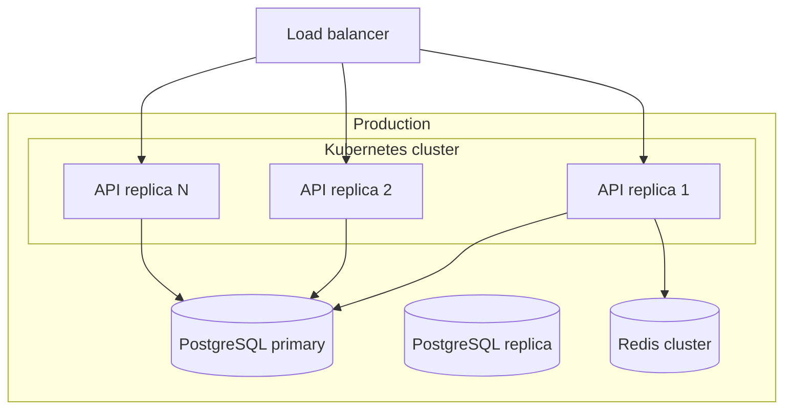

# Deployment

<!-- Deployment-diagram scaffold for SAD §7 (Deployment view) → see claude/plugins/vam-sdlc/skills/architecture-design/SKILL.md -->
<!-- N/A allowed for XS/S that reuses an existing deployment unit with no change. -->

## Resources / scaling

| Component | Replicas | CPU / mem | Scale trigger |
|---|---|---|---|
| API | <N> | <m / Mi> | <CPU > 70%> |
| Redis | <N> | <m / Mi> | manual |
| Postgres | 1 primary + <N> replicas | <m / Mi> | manual |

## Networking
- <Network policy / mTLS / secrets management>
