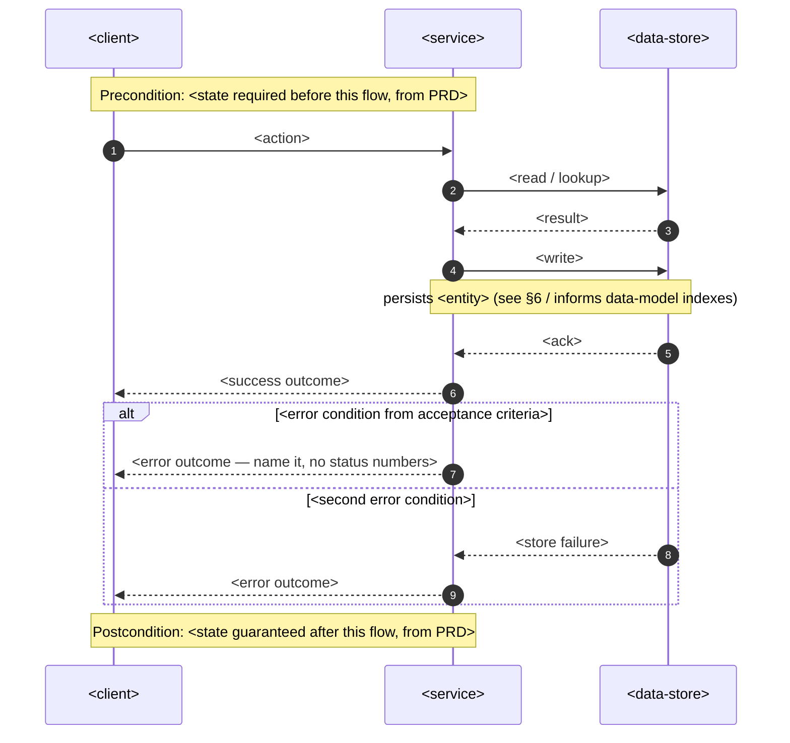
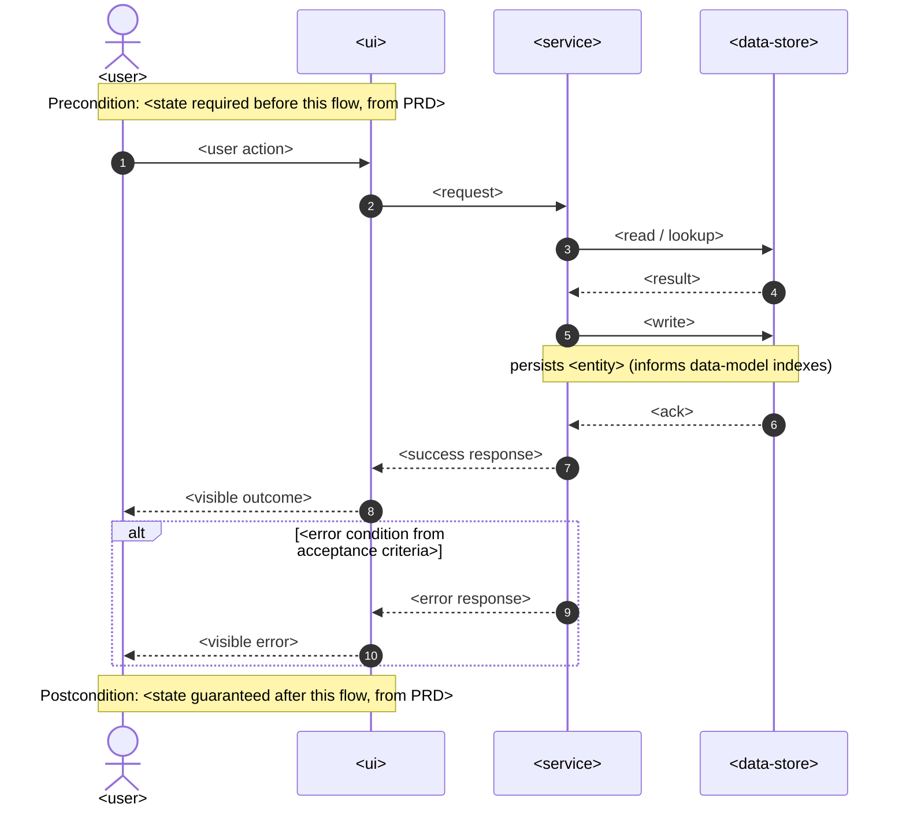
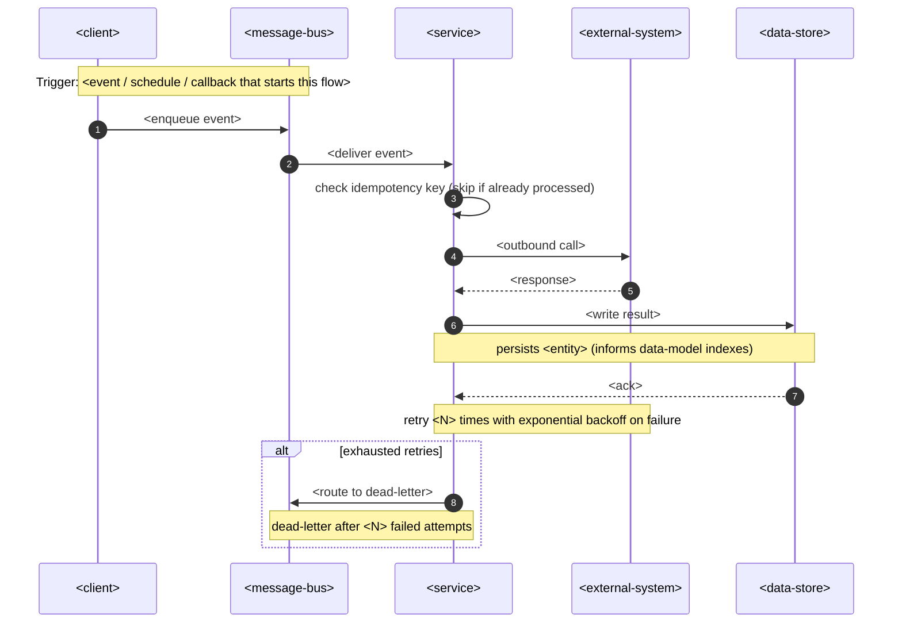

<!-- Template for `complete-sequence-diagrams` — embedded INLINE in docs/features/<slug>/sad.md §6 (Runtime view). -->
<!-- One `### <flow name>` block per critical flow. Participants are GENERIC placeholders —  -->
<!-- replace the <...> message/note text with this flow's specifics, NOT the participant names. -->
<!-- Generic vocabulary (the only allowed participants):                                        -->
<!--   <client>          — whatever initiates the flow (UI, CLI, another service, a scheduler) -->
<!--   <ui>              — a browser/mobile/desktop UI (only when target_surfaces declares one) -->
<!--   <service>         — the building block that owns this flow (from sad.md §5)             -->
<!--   <data-store>      — the persistent store the service reads/writes                       -->
<!--   <external-system> — a third party the service calls out to                              -->
<!--   <message-bus>     — async transport (queue / event stream) for non-sync flows           -->
<!-- Naming the concrete technology is architecture-design / generate-data-model's job.        -->
<!-- When sad.md frontmatter declares a UI surface (web-frontend / mobile-app / desktop-app), -->
<!-- draw UI-driven flows: <user> (actor) -> <ui> -> <service> -> <data-store>.               -->

### <flow name>

<!-- SYNC flow: request -> response, with the error branches the PRD's acceptance criteria demand. -->
<!-- Every write becomes a persist note so generate-data-model knows what to index downstream.    -->

<!-- UI-driven variant — use when sad.md target_surfaces includes web-frontend / mobile-app / desktop-app.  -->
<!-- Replace the block above with this shape for those flows.                                               -->

### <UI-driven flow name>

### <async flow name>

<!-- ASYNC flow (webhook in / scheduled job / queued or event-driven step / third-party callback). -->
<!-- MUST include: idempotency-key check as the first handler step, a retry note, a dead-letter branch. -->

